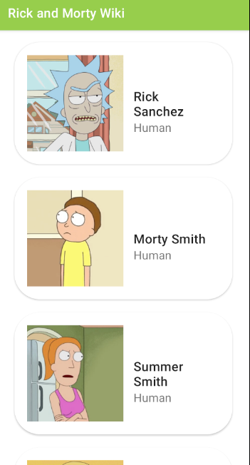
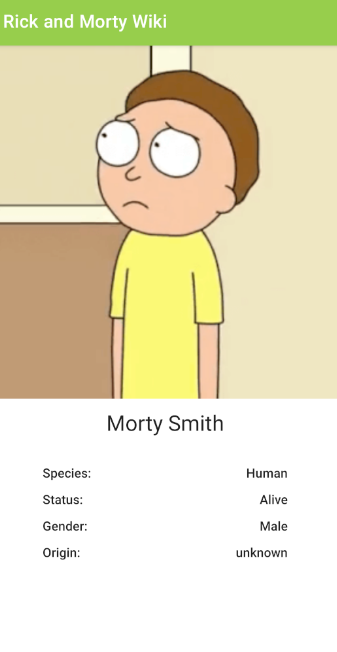

# Rick and Morty Wiki
Aplicación construida en Android para mostrar los personajes de Rick and Morty y el detalle de cada uno de ellos. Utilizamos [The Rick and Morty API](https://rickandmortyapi.com/)

## Setup/Requerimientos
Para correr la app es necesario contar con Android Studio y un emulador/Android Device. 
1. Clonar el proyecto
2. Importar el proyecto a Android Studio
3. Deploy en el dispositivo. 

## Arquitectura
Este proyecto implementa el patrón MVVM y sigue las prácticas de Clean Architecture para hacer un código más robusto y mantenible.
Presentation: ViewModel, Fragments y Activity. 
Data: Models, implementaciones del repositorio y sources donde se conecta la API. 
Domain: UseCases y repositorio como definición.

## Librerías utilizadas

- [Glide](https://github.com/bumptech/glide) 
- [ViewModel](https://developer.android.com/topic/libraries/architecture/viewmodel) 
- [LiveData](https://developer.android.com/topic/libraries/architecture/livedata) 
- [Coroutines](https://developer.android.com/kotlin/coroutines) 
- [Retrofit](https://square.github.io/retrofit) 
- [Koin](https://insert-koin.io/) 
- [Navigation Components](https://developer.android.com/guide/navigation/navigation-getting-started)

## Screenshots

